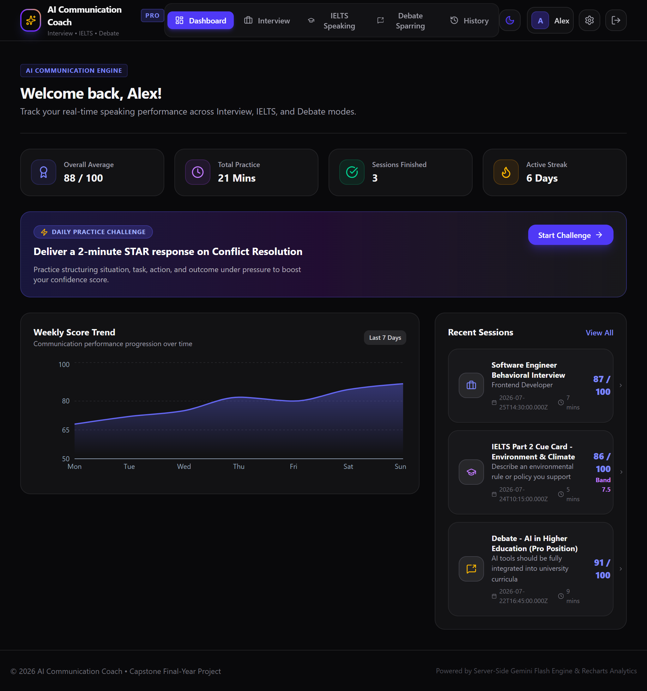
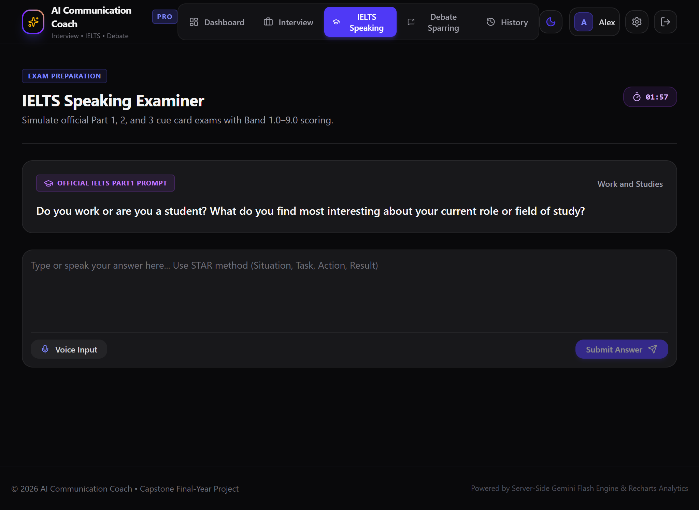

#  AI Communication Coach

## An AI-Powered Personal Communication Training Platform


---

#  Live Application

**Live Demo:**  
https://ai-communication-coach-1.ai.studio/

**GitHub Repository:**  
https://github.com/Saidamin45/smart-communication-coach.git

---

# 📖 Project Overview

## What is AI Communication Coach?

AI Communication Coach is an intelligent communication improvement platform that uses Artificial Intelligence to help users develop stronger speaking, reasoning, and professional communication skills.

The application combines three major communication training areas:

1. AI IELTS Speaking Coach
2. AI Interview Coach
3. AI Debate Coach

Instead of using separate platforms for exam preparation, interview preparation, and speaking practice, users get one AI-powered personal communication mentor.

The system analyzes user responses, identifies weaknesses, tracks improvement, and generates personalized recommendations.

---

#  Motivation and Problem Statement

## The Problem

Communication skills are becoming increasingly important in education and professional life.

However, many students and job seekers face several challenges:

### IELTS Students

- Lack of speaking partners
- Limited feedback
- No real examiner simulation
- Difficulty identifying speaking weaknesses


### Job Seekers

- Practice interviews are difficult to access
- Users cannot receive instant professional feedback
- They struggle with confidence and answer structure


### Students and Professionals

- Limited opportunities for debate practice
- Weak critical thinking skills
- Difficulty presenting ideas clearly


Existing applications usually solve only one problem:

- IELTS preparation only
- Interview preparation only
- Language learning only

There is no single platform that builds a complete communication profile.

---

# Proposed Solution

AI Communication Coach solves this problem by creating an AI-powered communication training ecosystem.

The platform works as a personal communication mentor that:

- Simulates real conversations
- Evaluates responses
- Measures communication ability
- Provides personalized improvement plans
- Tracks progress over time


The main objective is:

> Help users become better communicators through continuous AI-powered practice.

---

# ⭐ Key Features

---

# 1. AI Interview Coach

## Description

The AI Interview Coach simulates realistic professional interviews.

Users can practice different interview environments.

Supported interview types:

- Human Resource Interviews
- Technical Interviews
- Behavioral Interviews
- University Admission Interviews


## How It Works

User starts an interview session.

↓

AI generates realistic questions.

↓

User provides answers.

↓

AI evaluates the response.

↓

AI asks follow-up questions.

↓

Final performance report is generated.


## Evaluation Criteria

The AI evaluates:

| Category | Description |
|-|-|
| Confidence | How confidently the answer is delivered |
| Grammar | Sentence correctness |
| Vocabulary | Word selection and variety |
| Structure | Organization of answer |
| Professionalism | Workplace communication quality |
| Relevance | Answer accuracy |


## Generated Report

Example:

```
Interview Score: 86/100

Strengths:
✓ Good explanation ability
✓ Professional vocabulary

Weaknesses:
- Answers lack examples
- Limited STAR method usage

Recommendations:
Practice structured answers using STAR framework.
```

---

# 2. AI IELTS Speaking Coach

## Description

The IELTS Coach provides a realistic IELTS Speaking simulation.

The AI behaves like an official IELTS examiner.


## IELTS Structure

The system follows:

### Part 1

Introduction and general questions.


### Part 2

Long speaking task.

User receives:

- Topic card
- Preparation time
- Speaking time


### Part 3

Discussion and deeper questions.


## Evaluation System

The AI evaluates according to IELTS criteria:

| IELTS Criteria | Description |
|-|-|
| Fluency | Speaking flow |
| Lexical Resource | Vocabulary ability |
| Grammar | Accuracy and complexity |
| Pronunciation | Speech clarity |


## Output

Example:

```
Estimated IELTS Band:

7.5

Fluency:
8

Vocabulary:
7

Grammar:
7

Pronunciation:
8
```

---

# 3. AI Debate Coach

## Description

The Debate Coach improves:

- Critical thinking
- Logical reasoning
- Persuasive communication


## Working Process

User selects a topic.

Example:

"Should AI replace programmers?"

↓

AI chooses the opposite position.

↓

A debate conversation begins.

↓

AI challenges arguments.

↓

Final debate analysis is generated.


## Analysis Includes

- Argument strength
- Evidence usage
- Logical fallacies
- Persuasiveness
- Confidence


Example:

```
Debate Performance:

Logic:
88%

Evidence:
75%

Confidence:
82%

Critical Thinking:
90%
```

---

# 4. AI Communication Analysis Engine

The core intelligence of the platform is a reusable AI evaluation system.

Every interaction is analyzed.

The AI measures:

```
Communication Score

├── Grammar
├── Vocabulary
├── Fluency
├── Confidence
├── Professionalism
├── Critical Thinking
└── Relevance
```

Each user receives a personalized communication profile.

---

# 5. Personalized Learning System

The application does not only evaluate mistakes.

It learns user weaknesses.

Example:

User repeatedly makes grammar mistakes.

The system automatically creates:

- Grammar exercises
- Vocabulary practice
- Speaking activities
- Interview questions
- Debate topics


The AI creates a personalized improvement journey.

---

# 6. Progress Dashboard

Users can monitor growth through a personal dashboard.


Dashboard contains:

## Communication Score

Overall performance score.

## Skill Tracking

- Grammar
- Vocabulary
- Fluency
- Confidence
- Critical Thinking


## Analytics

Users can view:

- Previous sessions
- Improvement trends
- Completed challenges
- Performance history

---

# 7. Daily Communication Challenge

To build consistent practice habits, users receive daily activities.


Daily challenge includes:

1 IELTS speaking question

+

1 Interview question

+

1 Debate topic


The goal:

15 minutes of daily communication improvement.

---

#  Artificial Intelligence Implementation

## AI Model

The application uses:

Google Gemini API


The AI handles:

- Conversation generation
- Question creation
- Answer evaluation
- Scoring
- Feedback generation
- Personalized recommendations


---

# AI System Instruction

The AI model is controlled using a custom system prompt:


```
You are an AI Communication Coach.

Your purpose is to improve user communication skills.

You simulate:

- IELTS examinations
- Professional interviews
- Debate discussions


Analyze responses based on:

Grammar

Vocabulary

Fluency

Confidence

Professionalism

Critical Thinking

Logical Structure


Provide detailed feedback.

Identify weaknesses.

Generate personalized recommendations.


Return structured JSON reports.
```

---

#  System Architecture


```
                 USER

                  |

                  |

          Next.js Frontend

                  |

                  |

          API Route Layer

                  |

                  |

        AI Service Controller

                  |

                  |

           Gemini API

                  |

                  |

          Firebase Database

                  |

                  |

        Progress Dashboard

```


---

# Technology Stack


## Frontend

- Next.js 15
- React
- TypeScript
- Tailwind CSS
- shadcn/ui


## Backend

- Next.js API Routes


## Database

- Firebase Firestore


## Authentication

- Firebase Authentication


## Artificial Intelligence

- Google Gemini API


## Data Visualization

- Recharts


## Deployment

- Vercel


## Version Control

- GitHub

---

# Project Structure


```
AI-Communication-Coach

│
├── app
│   ├── dashboard
│   ├── interview
│   ├── ielts
│   ├── debate
│   ├── profile
│   └── api
│
├── components
│
├── services
│   ├── ai
│   ├── firebase
│   └── analytics
│
├── hooks
│
├── types
│
├── lib
│
├── public
│
└── README.md

```

---

#  Database Design


## Users Collection

Stores user information.

Example:

```
users

id

name

email

createdAt
```


---

## Sessions Collection

Stores practice history.


```
sessions

id

userId

type

score

feedback

createdAt
```


---

## Communication Profile


```
profiles

userId

communicationScore

skills

weaknesses

recommendations
```

---

#  Security

The application follows security best practices.

Implemented:

✅ Environment variables

✅ Firebase authentication

✅ Protected routes

✅ Input validation

✅ Secure API communication

✅ No exposed API keys

---

#  Installation Guide


## Clone Repository

```bash
git clone https://github.com/Saidamin45/ai-communication-coach.git
```


## Enter Project Folder

```bash
cd ai-communication-coach
```


## Install Dependencies

```bash
npm install
```


## Environment Setup

Create:

```
.env.local
```


Add:


```
GEMINI_API_KEY=

NEXT_PUBLIC_FIREBASE_API_KEY=

NEXT_PUBLIC_FIREBASE_PROJECT_ID=

NEXT_PUBLIC_FIREBASE_AUTH_DOMAIN=
```


## Start Development Server


```bash
npm run dev
```


Open:

```
http://localhost:3000
```

---

#  Deployment


The application is deployed using google studio.
But you can also deploy at Vercel:
For Vercel follow the steps:

Deployment Process:

1. Push project to GitHub.

2. Connect repository with Vercel.

3. Add environment variables.

4. Deploy application.


---

# 📸 Application Screenshots


## Landing Page


## Interview Coach




## Interview Coach


## IELTS Coach




## Debate Coach


## History


## Profile


## Settings


---

#  Testing Checklist


Before submission:


✅ User registration works

✅ Login works

✅ Dashboard loads

✅ AI generates responses

✅ Interview simulation works

✅ IELTS evaluation works

✅ Debate evaluation works

✅ Reports generate correctly

✅ Data saves correctly

✅ Responsive design works

✅ Deployment works


---

#  Future Improvements


Possible future features:


## Voice Analysis

Add:

- Pronunciation scoring
- Speaking speed analysis
- Filler word detection


## Video Communication Analysis

Analyze:

- Eye contact
- Facial expressions
- Body language


## Community Practice

Allow users to:

- Join speaking rooms
- Practice debates
- Give feedback


## Mobile Application

Create Android and iOS versions.

---

# Academic Value

This project demonstrates practical implementation of:

- Artificial Intelligence
- Large Language Models
- Full-stack development
- Cloud databases
- Authentication systems
- Data visualization
- Human-centered design


---

# Developer
Owner:
**SAID AMIN**

https://github.com/Saidamin45

Contributors List:

Please don't be confused both accounts belong to me:

this is my old account and for this project I have made a new account
while using the other one is the contributor.

**GUL KHAN**

https://github.com/24460gk


---


# 📄 License

**Open Source**

This project is developed as an individual academic final project for ACT AI.

Contributions are appreciated. Feel free to reach out to us.

Thank you!

